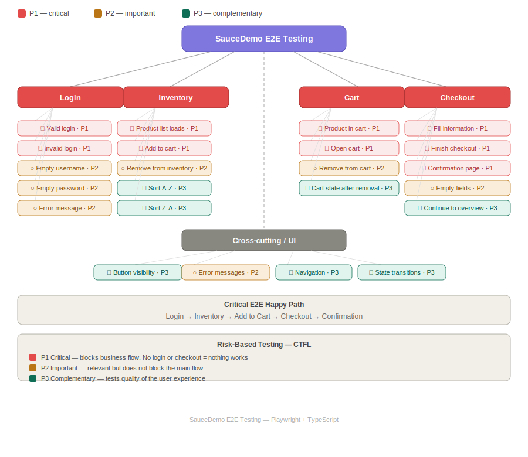

# SauceDemo E2E Testing (Playwright)

This project is an end-to-end (E2E) test automation suite built using Playwright.

It demonstrates a structured QA approach, covering core user flows, positive and negative scenarios, and applying fundamental testing techniques.

---

## 🚀 Tech Stack

- Playwright  
- TypeScript  
- Node.js  

---

## 🧪 Example Flow

Login → Add Product → Cart → Checkout → Order Confirmation

---

## 📌 Test Coverage

The test suite covers the main user journey, including positive and negative scenarios:

### 🔐 Authentication
- Successful login with valid credentials  
- Error handling:
  - Invalid username  
  - Invalid password  
  - Missing username  
  - Missing password  

### 🛒 Inventory & Cart
- Product information visibility (name, price, image)  
- Validate multiple products are displayed  
- Validate total number of products  
- Sort products by price (low → high)  
- Add product to cart  
- Navigate to cart page  
- Validate correct product in cart  
- Remove product from cart  

### 💳 Checkout
- Complete purchase flow  
- Validation of required fields:
  - Missing first name  
  - Missing last name  
  - Missing postal code  
- Checkout overview validation  
- Cancel checkout flow (returns to cart page)  
- Validate order confirmation message  

---

## 🧠 Test Design Approach

Before implementing the tests, I analyzed the application and identified the main user flows:

- Login  
- Product Inventory  
- Cart  
- Checkout  

Test scenarios were prioritized based on:

- Business impact  
- User journey criticality  
- Stability for automation  

Test design techniques used:

- Equivalence Partitioning  
- Negative Testing  
- Boundary validation (required fields)  

---

## 💡 Notes

- Tests use `data-test` selectors when available for better stability  
- Page Object Model (POM) is used to improve maintainability  
- Reusable helpers are implemented for common user flows  
- Test data is separated from test logic  
- `beforeEach` is used to handle common setup steps  

---

## 🗺️ Test Strategy Map



---

## 📈 Future Improvements

### Short Term
- Add more negative scenarios (edge cases)  
- Improve validation of totals and pricing  

### Mid Term
- Introduce dynamic test data generation  

### Long Term
- Integrate CI pipeline using GitHub Actions  

---

## ⚙️ How to Run

Install dependencies:

```bash
npm install

npx playwright test

npx playwright test


```
---
## 📂 Project Structure
tests/
  auth/
    login.spec.ts
  inventory/
    inventory.spec.ts
  checkout/
    checkout.spec.ts

pages/
  LoginPage.ts
  InventoryPage.ts
  CartPage.ts
  CheckoutPage.ts

utils/
  flowHelpers.ts

test-data/
  loginData.ts
  checkoutData.ts

docs/
  test-cases.md
  mind-map.svg